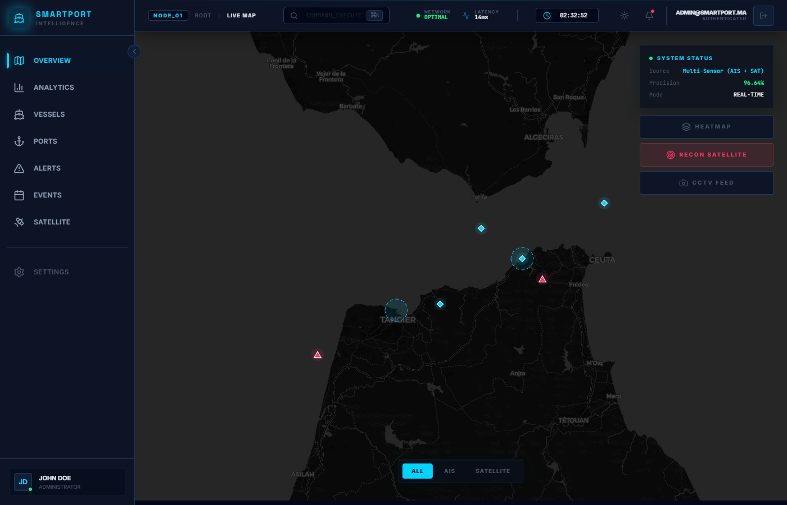
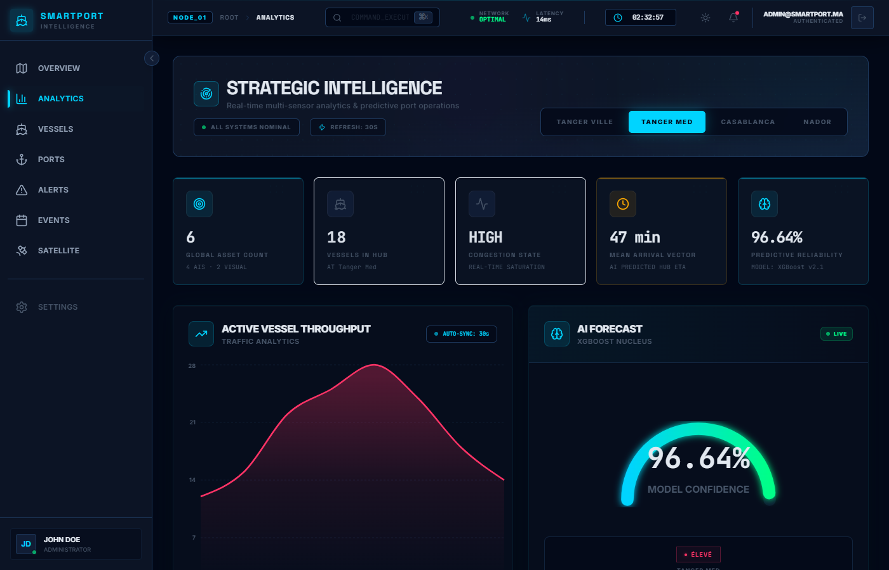
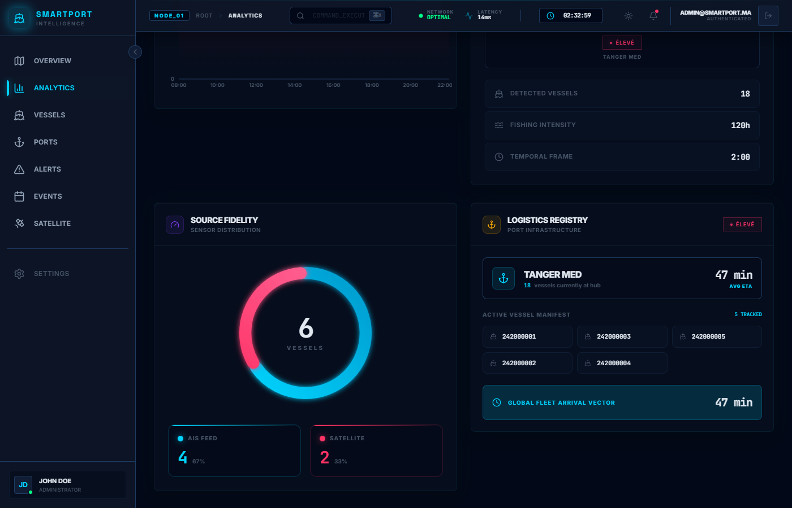
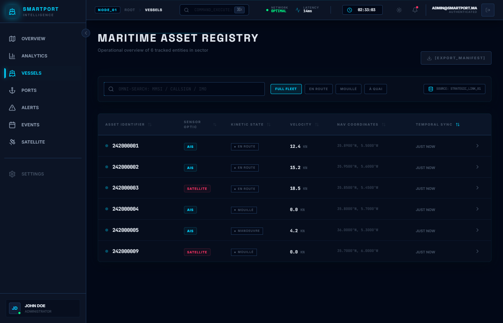
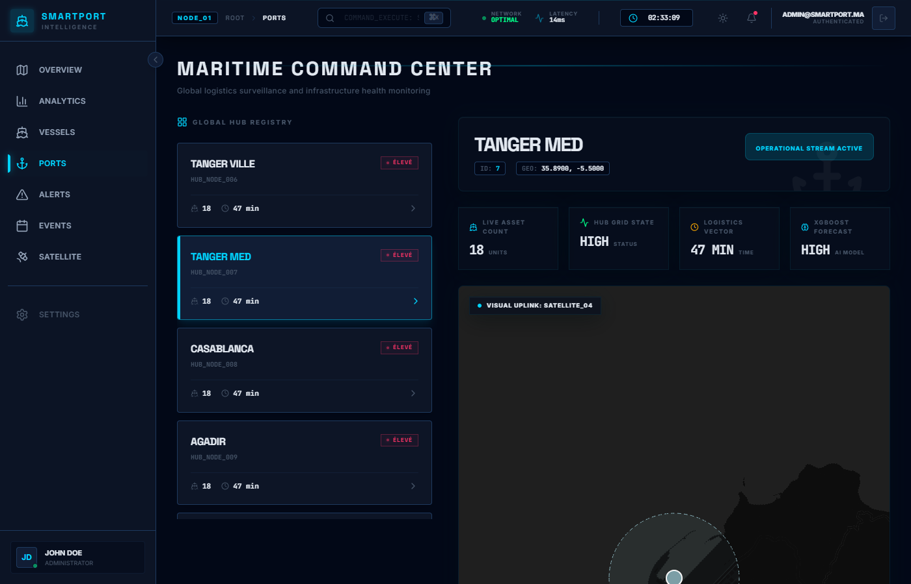
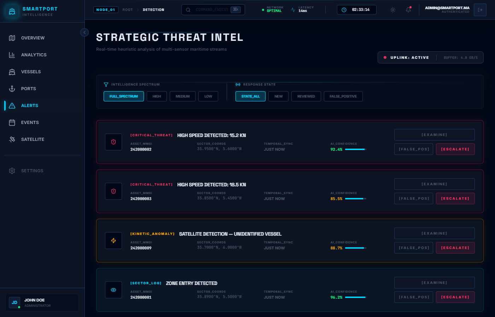
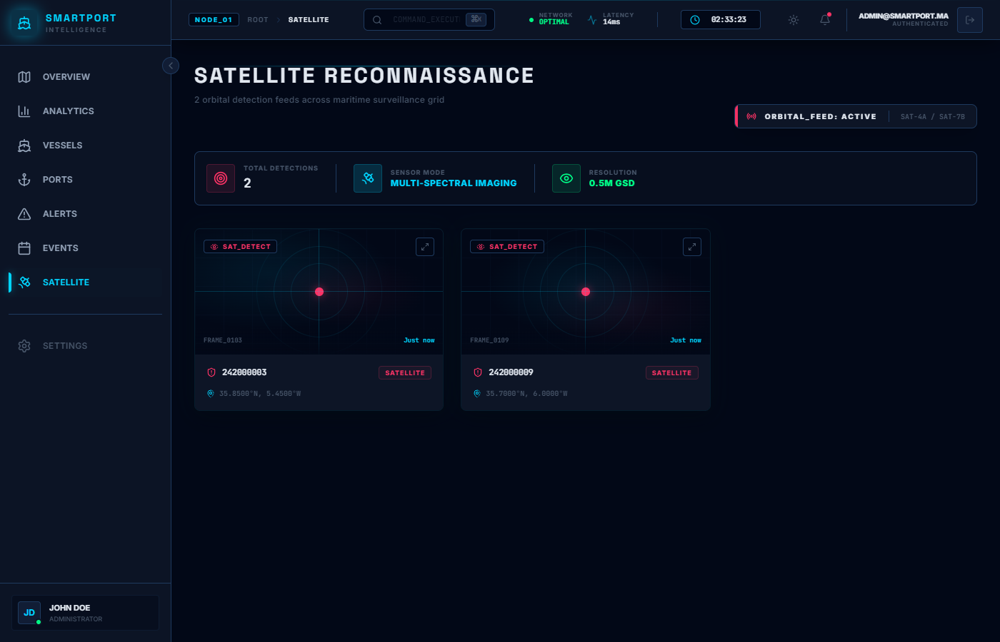
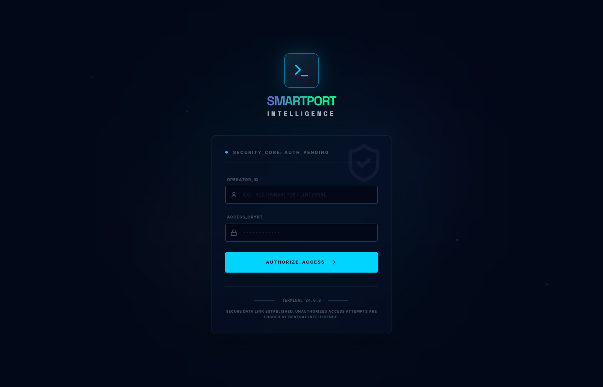

<h1 align="center">SMARTPORT INTELLIGENCE</h1>

<p align="center">
  <strong>Next-Generation Maritime Surveillance & Port Management Platform</strong>
</p>

<p align="center">
  
  
  
  
  
  
  
</p>

<p align="center">
  A state-of-the-art maritime intelligence system combining real-time AIS tracking, satellite imagery fusion, and AI-driven predictive analytics to monitor port congestion, vessel movements, and maritime anomalies across the Mediterranean.
</p>

---

## Preview

### Live Map & Dashboard
> Real-time vessel tracking with AIS & satellite data fusion on an interactive Leaflet map. Multi-sensor overlay with heatmap, satellite recon, and CCTV integration.



### Strategic Intelligence (Analytics)
> Advanced analytics with custom SVG charts, animated gradient donut charts, XGBoost AI forecasting gauge, and real-time KPI monitoring.




### Maritime Asset Registry (Vessels)
> Complete fleet management with sortable data tables, status filters, real-time speed/position tracking, and CSV export capabilities.



### Maritime Command Center (Ports)
> Port-level deep dive with live asset counts, congestion states, XGBoost prediction, and embedded satellite map view with fly-to animations.



### Strategic Threat Intel (Alerts)
> AI-powered anomaly detection with confidence scores, severity classification (Critical/Kinetic/Sector), and actionable threat response.



### Satellite Reconnaissance
> Orbital detection feeds with multi-spectral imaging, SAR/optical satellite imagery analysis, and automated vessel identification.



### Secure Authentication
> Military-grade login terminal with animated glitch effects, particle backgrounds, and encrypted access control.



---

## Tech Stack

| Layer | Technology | Purpose |
|-------|-----------|---------|
| **Framework** | React 19 + TypeScript | Component architecture & type safety |
| **Build Tool** | Vite 8 | Lightning-fast HMR & optimized builds |
| **Styling** | Tailwind CSS 4 | Utility-first CSS with CSS variable theming |
| **Animations** | Framer Motion 12 | Physics-based animations, layout transitions, gestures |
| **Maps** | Leaflet + React-Leaflet | Interactive maritime mapping with custom tile layers |
| **Charts** | Custom SVG + Recharts | Hand-crafted gradient charts with glow effects |
| **State** | Zustand + TanStack Query | Client state + server state with auto-refetching |
| **Routing** | React Router 7 | File-based navigation with protected routes |
| **HTTP** | Axios | API client with interceptors & mock data layer |
| **Icons** | Lucide React | Consistent, tree-shakeable icon system |
| **Backend** | Django REST Framework | REST API with authentication & data processing |
| **Database** | PostgreSQL + PostGIS | Spatial queries for maritime geolocation data |
| **AI/ML** | XGBoost | Port congestion prediction & ETA forecasting |

---

## Architecture

```
smartport-intelligence/
├── frontend/                      # React SPA
│   ├── src/
│   │   ├── api/                   # API clients (Axios + mock data layer)
│   │   │   ├── client.ts          # Base Axios instance + mock toggle
│   │   │   ├── analytics.ts       # Port status, congestion IA endpoints
│   │   │   ├── vessels.ts         # Fleet tracking CRUD
│   │   │   ├── ports.ts           # Port infrastructure data
│   │   │   ├── detections.ts      # Satellite detection feeds
│   │   │   ├── alerts.ts          # Threat intel alerts
│   │   │   ├── events.ts          # Entry/exit event logs
│   │   │   └── satellite.ts       # Orbital imagery data
│   │   ├── components/
│   │   │   ├── layout/            # Sidebar, Header, AppLayout
│   │   │   ├── ui/                # SharedUI (GlassCard, MagneticButton, StatusBadge...)
│   │   │   └── port/              # Port-specific components
│   │   ├── pages/
│   │   │   ├── Dashboard/         # Live Map + system status
│   │   │   ├── Analytics/         # Strategic Intelligence dashboards
│   │   │   ├── Vessels/           # Maritime Asset Registry
│   │   │   ├── Ports/             # Maritime Command Center
│   │   │   ├── Detection/         # Threat Intel & anomaly alerts
│   │   │   ├── Events/            # Strategic Asset Feed (entry/exit logs)
│   │   │   ├── Satellite/         # Orbital reconnaissance
│   │   │   └── Auth/              # Login terminal
│   │   ├── store/                 # Zustand stores (auth, theme, vessels)
│   │   ├── hooks/                 # Custom hooks (3D tilt, ripple, magnetic)
│   │   └── utils/                 # Formatters, helpers
│   └── package.json
├── backend/                       # Django REST API
│   ├── api/                       # DRF views, serializers, models
│   ├── ai_models/                 # XGBoost training & inference
│   └── manage.py
└── docs/screenshots/              # UI screenshots
```

---

## Features

### Core Platform
- **Real-Time AIS Tracking** — Live vessel positions on interactive dark-themed Leaflet maps with custom CartoDBDark tiles
- **Multi-Sensor Fusion** — Combined AIS transponder + satellite detection with source tagging
- **AI Congestion Prediction** — XGBoost model forecasting port congestion levels with confidence scores
- **ETA Forecasting** — Predictive arrival time computation based on vessel speed vectors and historical data
- **Satellite Reconnaissance** — Integration with orbital detection feeds (SAR/Optical multi-spectral imaging)
- **Threat Detection** — Automated anomaly alerts: high-speed violations, unidentified vessels, zone intrusions

### Premium UI/UX
- **Glassmorphism Panels** — Frosted-glass cards with `backdrop-blur-xl` and layered border effects
- **3D Tilt Cards** — GPU-accelerated `perspective(1000px)` transforms responding to cursor position
- **Magnetic Buttons** — Cursor-following hover effects with spring-physics via Framer Motion
- **Ripple Effects** — Material-style click ripples with radial gradient animations
- **Neon Glow Borders** — Animated `conic-gradient` borders with pulsing accent colors
- **Animated SVG Charts** — Custom gradient-stroke donut charts with `strokeDasharray` reveal animations
- **Staggered Animations** — Sequential fade-in/slide-up on page load with configurable delays
- **Dark/Light Theme** — Full dual-mode theming via CSS custom properties with smooth transitions
- **Responsive Design** — Fluid layouts from mobile (375px) to ultrawide (1600px+)

---

## Quick Start

### Prerequisites
- Node.js 18+
- npm or yarn

### Installation

```bash
# Clone the repository
git clone https://github.com/your-username/smartport-intelligence.git
cd smartport-intelligence

# Install frontend dependencies
cd frontend
npm install

# Start development server
npm run dev
```

The app launches at **http://localhost:5173** with mock data — no backend required.

### Default Credentials
```
Email:    admin@smartport.ma
Password: admin123
```

### Backend Integration (Optional)

```bash
# Start Django backend
cd backend
pip install -r requirements.txt
python manage.py migrate
python manage.py runserver

# In frontend/src/api/client.ts, set:
# USE_MOCK = false
```

The Vite dev server proxies `/api/*` to `http://127.0.0.1:8000` automatically.

---

## Pages Overview

| Page | Route | Description |
|------|-------|-------------|
| **Live Map** | `/` | Interactive vessel tracking map with real-time positions, multi-sensor overlay, and system status panel |
| **Analytics** | `/analytics` | Strategic intelligence dashboard with KPIs, traffic throughput charts, AI forecast gauge, source distribution donut, and port logistics |
| **Vessels** | `/vessels` | Searchable/sortable fleet registry with speed, coordinates, status, and sensor source for each tracked vessel |
| **Ports** | `/ports` | Port command center with selectable hub cards, live metrics (congestion, ETA, AI prediction), and embedded satellite map |
| **Alerts** | `/detection` | Threat intel feed with severity filters, AI confidence bars, and actionable response buttons (Examine/Escalate) |
| **Events** | `/events` | Chronological entry/exit event log with timeline visualization, type filters, and CSV export |
| **Satellite** | `/satellite` | Orbital detection gallery with detection frames, MMSI identification, and coordinate pinpointing |

---

## Design System

### Color Palette

| Token | Dark Mode | Purpose |
|-------|-----------|---------|
| `--accent-primary` | `#00d4ff` | Primary accent (cyan neon) |
| `--bg-base` | `#0a0e17` | Deepest background |
| `--bg-surface` | `#111827` | Card surfaces |
| `--bg-elevated` | `#1a2236` | Elevated panels |
| `--status-safe` | `#00ff88` | Success / Low severity |
| `--status-warn` | `#ffaa00` | Warning / Medium severity |
| `--status-danger` | `#ff3366` | Critical / High severity |
| `--status-info` | `#7c3aed` | Satellite / Info |

### Typography
- **Display**: `font-display` — Bold, tracking-tight headings
- **Mono**: `font-mono` — Data values, coordinates, identifiers
- **Sizes**: 8px labels to 48px hero stats, all using `font-black` weight

### Component Library
- `GlassCard` — Frosted glass container with optional 3D tilt
- `MagneticButton` — Hover-magnetic button with ripple (variants: primary, ghost, danger)
- `StatusBadge` — Color-coded status pills (LOW/MEDIUM/HIGH/AIS/SATELLITE)
- `PageHeader` — Consistent page title + subtitle with decorative elements
- `LoadingSkeleton` — Animated placeholder shimmer
- `EmptyState` — No-data state with icon and message
- `CountUp` — Animated number counter with spring physics

---

## Performance

- **Vite 8** — Sub-second HMR, optimized chunking
- **React 19** — Concurrent rendering, automatic batching
- **TanStack Query** — Smart caching, background refetching, stale-while-revalidate
- **Tailwind CSS 4** — Zero-runtime CSS, automatic purging
- **Tree-shaking** — Lucide icons individually imported, no bundle bloat
- **GPU Acceleration** — All animations use `transform` and `opacity` for 60fps

---

## License

MIT License. See [LICENSE](LICENSE) for details.

---

<p align="center">
  <sub>Built with precision for maritime intelligence operations.</sub>
</p>
